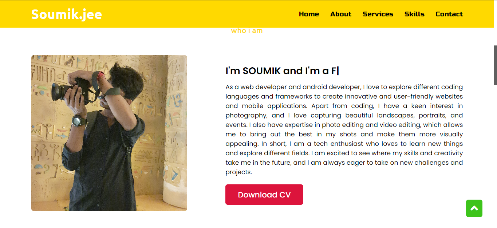

# My-portfolio

Creating a portfolio website with HTML, CSS, and JavaScript is an exciting process. HTML provides structure, CSS adds style, and JavaScript brings interactivity. Together, they enable you to showcase your skills and projects effectively, leaving a lasting impression on visitors. Embrace the creative process and let your portfolio website reflect your unique professional identity and accomplishments.
